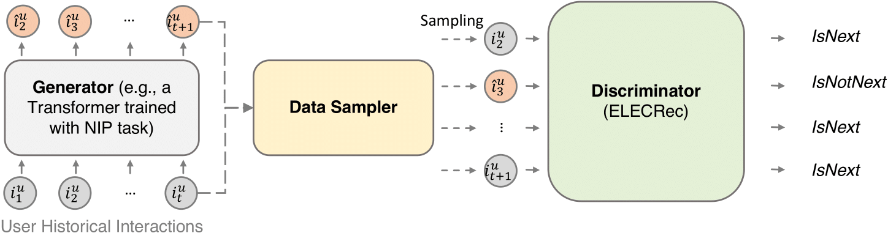
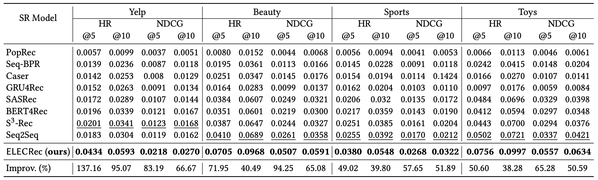

# ELECRec

Source code for paper: [ELECRec: Training Sequential Recommenders as Discriminators](https://arxiv.org/pdf/2204.02011.pdf)

## Introduction


Motivation: 

Sequential recommendation is often considered as a generative task, i.e., training a sequential encoder to generate the next item of a user’s interests based on her historical interacted items. Despite their prevalence, these methods usually require training with more meaningful samples to be effective, which otherwise will lead to
a poorly trained model.


Model Architecture:



## Result Summary

Following table shows the overall comparison with other sequential models.



See [our paper](https://arxiv.org/pdf/2204.02011.pdf) for more details. 


## Implementation
### Requirements

Python >= 3.7  
Pytorch >= 1.2.0  
tqdm == 4.26.0 

### Datasets

Four prepared datasets are included in `data` folder.


### Evaluate Model

We provide the trained models on Yelp, Beauty, Sports_and_Games, and Toys_and_Games datasets in `./src/output` folder. You can directly evaluate the trained models on test set by running:

```
python main.py --data_name <Data_name> --model_idx 0 --do_eval
```

You are expected following results:


On Beauty:

```
{'Epoch': 0, 'HIT@5': '0.0703', 'NDCG@5': '0.0503', 'HIT@10': '0.0964', 'NDCG@10': '0.0587', 'HIT@20': '0.1311', 'NDCG@20': '0.0674'}
```

On Sports:

```
{'Epoch': 0, 'HIT@5': '0.0380', 'NDCG@5': '0.0268', 'HIT@10': '0.0548', 'NDCG@10': '0.0322', 'HIT@20': '0.0766', 'NDCG@20': '0.0377'}
```

On Toys:

```
{'Epoch': 0, 'HIT@5': '0.0756', 'NDCG@5': '0.0557', 'HIT@10': '0.0997', 'NDCG@10': '0.0634', 'HIT@20': '0.1316', 'NDCG@20': '0.0714'}
```

On Yelp:

```
{'Epoch': 0, 'HIT@5': '0.0434', 'NDCG@5': '0.0218', 'HIT@10': '0.0593', 'NDCG@10': '0.0270', 'HIT@20': '0.0649', 'NDCG@20': '0.0285'}
```

Please feel free to test is out!

### Train Model

To train ELECRec on a specific dataset, change to the `src` folder and run following command: 

```
bash scripts/run_<data_name>.sh
```

The script will automatically train ELECRec and save the best model found in validation set, and then evaluate on test set.

Explanation of key arguments in the script:

```
--gen_loss_weight: strength of generator loss    
--sample_ratio: percentage of target items in a sequences will be replaced by the predict items from generator.     
--dis_loss_weight: strength of discriminator loss
--model_shared_type: model parameter sharing strategy between generator and discriminator
```

## Reference

```
@inproceedings{chen22elecrec,
  title = "ELECRec: Training Sequential Recommenders as Discriminators",
  author = "Yongjun Chen and Jia Li and Caiming Xiong",
  year = "2022",
  booktitle = "SIGIR"
}
```
